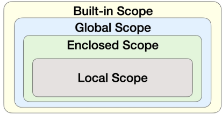

## 오늘 배운 내용 정리
- 파이썬 공식 문서 자습서, 라이브러리 레퍼런스. 언어 레퍼런스 참고 (추가 학습)

# 함수
```python
def make_sum(pram1, pram2): # pram1, pram2는 매개변수
    """이것은 두 수를 받아
    두수의 합을 반환하는 함수입니다.
    >>> make_sum(1, 2)
    3
    """
    return pram1 + pram2

a = 2
b = 3

sum_result = make_sum(a, b) # a와 b는 인자
print(sum_result) # 5
```
- 함수 내에서 return 문이 없다면 None이 반환됨
---
# 함수의 특징(중요)
- print() 함수는 화면에 값을 출력하기만 할 뿐, 반환(return)값이 없음
```python
return_value = print(1) # 화면에 1을 출력할 뿐, return_value에는 1이 할당되지 않음
print(return_value) # None
```
# 인자
---
- 위치 인자 
1. 함수 호출 시 인자의 위치에 따라 전달되는 인자
2. 위치 인자는 함수 호출 시 반드시 값을 전달해야 함.
```python
def greet(name, age):
    print(f'안녕하세요, {name}님! {age}살이시군요.')


greet('Alice', 25)  # 안녕하세요, Alice님! 25살이시군요.
greet(25, 'Alice')  # 안녕하세요, 25님! Alice살이시군요.
greet('Alice')  # TypeError: greet() missing 1 required positional argument: 'age'
```
- 기본 인자 값
1. 함수 정의에서 매개변수에 기본 값을 할당하는 것
2. 함수 호출 시 인자를 전달하지 않으면, 기본값이 매개변수에 할당됨
```python
def greet(name, age=20):
    print(f'안녕하세요, {name}님! {age}살이시군요.')


greet('Bob')  # 안녕하세요, Bob님! 30살이시군요.
greet('Charlie', 40)  # 안녕하세요, Charlie님! 40살이시군요.
```
- 키워드 인자
1. 함수 호출 시 인자의 이름과 함께 값을 전달하는 인자
2. 매개변수와 인자를 일치시키지 않고, 특정 매개변수에 값을 할당할 수 있음
3. 인자의 순서는 중요하지 않으며, 인자의 이름을 명시하여 전달
4. 단, 호출 시 키워드 인자는 위치 인자 뒤에 위치해야 함
```python
def greet(name, age):
    print(f'안녕하세요, {name}님! {age}살이시군요.')


greet(name='Dave', age=35)  # 안녕하세요, Dave님! 35살이시군요.
greet(age=35, name='Dave')  # 안녕하세요, Dave님! 35살이시군요.
greet(age=35, 'Dave')  # Positional argument cannot appear after keyword arguments
```
- 임의의 인자 목록
1. 정해지지 않은 개수의 인자를 처리하는 인자
2. 함수 정의 시 매개변수 앞에 '*'를 붙여 사용
3. 여러 개의 인자를 tuple로 처리
```python
def calculate_sum(*args):
    print(args)  # (1, 100, 5000, 30)
    print(type(args))  # <class 'tuple'>


calculate_sum(1, 100, 5000, 30)
```
- 임의의 키워드 인자 목록
1. 정해지지 않은 개수의 키워드 인자를 처리하는 인자
2. 함수 정의 시 매개변수 앞에 '**'를 붙여 사용
3. 여러 개의 인자를 dictionary로 묶어 처리
```python
def print_info(**kwargs):
    print(kwargs)


print_info(name='Eve', age=30)  # {'name': 'Eve', 'age': 30
```
- 함수 인자 권장 작성 순서
위치 → 기본 → 가변 → 가변 키워드
```python
# 인자의 모든 종류를 적용한 예시
def func(pos1, pos2, default_arg='default', *args, **kwargs):
    print('pos1:', pos1)
    print('pos2:', pos2)
    print('default_arg:', default_arg)
    print('args:', args)
    print('kwargs:', kwargs)


func(1, 2, 3, 4, 5, 6, key1='value1', key2='value2')
"""
pos1: 1
pos2: 2
default_arg: 3
args: (4, 5, 6)
kwargs: {'key1': 'value1', 'key2': 'value2'}
"""
```
---
# 재귀함수
재귀함수란 함수 내부에서 자기 자신을 호출하는 함수이므로 반드시 종료 조건을 설정해야 함.
```python
def factorial(n):
    # 종료 조건: n이 0이면 1을 반환
    if n == 0:
        return 1
    else:
        # 재귀 호출: n과 n-1의 팩토리얼을 곱한 결과를 반환
        return n * factorial(n - 1)


# 팩토리얼 계산 예시
print(factorial(5))  # 120
```
- 재귀함수의 장점: 특정 알고리즘 식을 표현할 때 변수의 사용이 줄어들며, 코드의 가독성이 높아짐
- 단점 : 재귀함수는 메모리 사용량이 많고 느릴 수 있으며 종료 조건이 잘못되면 스택 오버플로우 에러가 발생할 수 있으니 주의해야 함.
- 스택 오버플로우 : 작업 공간에 일이 너무 많이 쌓여 프로그램이 멈추는 오류
---
# 내장함수
파이썬이 기본적으로 제공하는 함수 (별도의 import 없이 바로 사용 가능)  
예 : print, len, sort, max, min, ...
---

# 함수와 SCOPE
- scope
  - built-in scope : 파이썬이 실행된 이후부터 영원히 유지
  - global scope : 코드 어디에서든 참조할 수 있는 공간
  - Enclosed scope : 함수 안에 함수가 있는 경우 경계
  - local scope : 함수가 만든 scope (함수 내부에서만 참조 가능)  
- variable
  - global variable : global scope에 정의된 변수
  - local variable : local scope에 정의된 변수

- 아래와 같은 순서(작은 영역부터 큰 영역으로)로 이름을 찾아 나가며, LEGB Rule이라고 부름
  1. local scope
  2. Enclosed scope
  3. Global scope
  4. Built-in scope  
  

- 함수 내에서는 바깥 Scope의 변수에 접근은 가능하나 수정은 할 수 없음

# 함수 네이밍 기본 규칙
  1. 소문자와 언더스코어 사용
  2. 동사로 시작하여 함수의 동작 설명
  3. 약어 사용 지양
  ```python
  # Good
  def calculate_total_price(price, tax):
    return price + (price * tax)


  # Bad
  def calc_price(p, t):
    return p + (p * t)
  ```
# 함수 이름 구성 요소
  1. 동사 + 명사
  2. 동사 + 형용사 + 명사
  3. get/set 접두사
  4. True/False를 반환한다면 is 또는 has로 시작하는 것을 추천

# 함수의 원칙
- 단일 책임 원칙  
모든 객체는 하나의 명확한 목적과 책임만을 가져야 함.

- 함수 설계 원칙  
1. 명확한 목적
2. 책임 분리
3. 유지보수성
추후 디버깅이 필요할 때, 여러개의 기능이 함수에 들어가면 수정하기 힘들기 때문에, 함수를 분리하여 저장하기

```python
# 잘못된 설계 예시 (여러 책임이 섞인 함수)
def process_user_data(user_data):
    # 책임 1: 데이터 유효성 검사
    if len(user_data['password']) < 8:
        raise ValueError('비밀번호는 8자 이상이어야 합니다')

    # 책임 2: 비밀번호 암호화 및 저장
    user_data['password'] = hash_password(user_data['password'])
    db.users.insert(user_data)

    # 책임 3: 이메일 발송
    send_email(user_data['email'], '가입을 환영합니다!')


# 올바른 설계 예시 (책임을 분리한 함수들)
def validate_password(password):
    """비밀번호 유효성 검사"""
    if len(password) < 8:
        raise ValueError('비밀번호는 8자 이상이어야 합니다')


def save_user(user_data):
    """비밀번호 암호화 및 저장"""
    user_data['password'] = hash_password(user_data['password'])
    db.users.insert(user_data)


def send_welcome_email(email):
    """환영 이메일 발송"""
    send_email(email, '가입을 환영합니다!')
```
# Packing & Unpacking
- 패킹 : 여러 개의 데이터를 하나의 컬렉션으로 모아 담는 과정
```python
packed_values = 1, 2, 3, 4, 5
print(packed_values) # (1, 2, 3, 4, 5)
```
'*'을 활용한 패킹
```python
def my_func(*args):
    print(args)  # (1, 2, 3, 4, 5)
    print(type(args))  # <class 'tuple'>

my_func(1, 2, 3, 4, 5)

def my_func2(**kwargs):
    print(kwargs)  # {'a': 1, 'b': 2, 'c': 3}
    print(type(kwargs))  # <class 'dict’>


my_func2(a=1, b=2, c=3)
```
- 언패킹 : 컬렉션에 담겨있는 데이터들을 개별 요소로 펼쳐 놓는 과정
```python
def my_function(x, y, z):
    print(x, y, z)


names = ['alice', 'jane', 'peter']
my_function(*names)  # alice jane peter

def my_function(x, y, z):
    print(x, y, z)


my_dict = {'x': 1, 'y': 2, 'z': 3}
my_function(**my_dict)  # 1 2 3
```

# 함수의 반환 규칙
- 파이썬 함수는 언제나 단 하나의 값(객체)만 반환할 수 있음
- 여러 값을 반환하는 경우에도 하나의 튜플로 패킹하여 반환

# lambda 람다 표현식
- 익명 함수를 만드는 데 사용되는 표현식
- 한 줄로 간단한 함수를 정의
```python
# 변경 전
def addition(x, y):
    return x + y


# 변경 후
lambda x, y: x + y


# 변경 전 활용
result = addition(3, 5)
print(result)  # 8


# 변경 후 활용
addition = lambda x, y: x + y
result = addition(3, 5)
print(result)  # 8


# 람다 표현식 활용 - 1 (with map 함수)
numbers = [1, 2, 3, 4, 5]


def square(x):
    return x**2


# lambda 미사용
squared1 = list(map(square, numbers))
print(squared1)  # [1, 4, 9, 16, 25]

# lambda 사용
squared2 = list(map(lambda x: x**2, numbers))
print(squared2)  # [1, 4, 9, 16, 25]
```

# 연습문제
1 c  
2 7
3 b
4 안녕하세요, 민수님
5 60
6 1
7 d
8 d
9 b
10 25