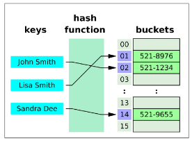

## 오늘 배운 내용
# 딕셔너리 메서드
**- D.get(k) : 키 k에 연결된 값을 반환 (키가 없으면 None을 반환)**
**- D.get(k, v) : 키 k에 연결된 값을 반환하거나 키가 없으면 기본 값으로 v를 반환**
**- D.keys() : 딕셔너리 D의 키를 모은 객체를 반환**
**- D.values() : 딕셔너리 D의 값을 모은 객체를 반환**
**- D.items() : 딕셔너리 D의 키/값 쌍을 모은 객체를 반환**
**- D.pop(k) : 딕셔너리의 D에서 키 k를 제거하고 연결됐던 값을 반환 (없으면 오류)**
**- D.pop(k, v) : 딕셔너리 D에서 키 k를 제거하고 연결됐던 값을 반환 (없으면 v를 반환)**
- D.clear() : 딕셔너리 D의 모든 키/값 쌍을 제ㅓ
- D.setdefault(k) : 딕셔너리 D에서 키 k와 연결된 값을 반환
- D.setdefault(k, v) : 딕셔너리 D에서 키 k와 연결된 값을 반환, k가 D의 키가 아니면 값 v와 연결한 키 k를 D에 추가하고 v를 반환
- D.update(other) : other 내 각 키에 대해 D에 있는 키면 D에 있는 그 키의 값을 other에 있는 값으로 대체, other에 있는 각 키에 대해 D에 없는 키면 키/값 쌍을 D에 추가
---
```python
person = {'name': 'Alice', 'age': 25}
print(person.get('name')) # Alice
print(person.get('country')) # None
print(person.get('country', '해당 키는 존재하지 않습니다.')) # 해당 키는 존재하지 않습니다.
print(person['name']) # Alice
print(person['country']) # 에러가 발생하여 아래 코드는 진행되지 않음
```
- 에러가 발생하지 않으려면 get 메서드를 사용하는 것이 유리
```python
person = {'name': 'Alice', 'age': 25}
person_keys = person.keys()  # dict_keys(['name', 'age'])
person['country'] = 'KOREA'
print(person_keys) # dict_keys(['name', 'age', 'country])로 동기화됨
```
---
```python
# keys
person = {'name': 'Alice', 'age': 25}
print(person.keys())  # dict_keys(['name', 'age'])
for key in person.keys():
    print(key)
    # name
    # age

# values
person = {'name': 'Alice', 'age': 25}
print(person.values())  # dict_values(['Alice', 25])
for value in person.values():
    print(value)
    # Alice
    # 25

# items
person = {'name': 'Alice', 'age': 25}
print(person.items())  # dict_items([('name', 'Alice'), ('age', 25)])
for key, value in person.items():
    print(key, value)
    # name Alice
    # age 25
```
---
```PY
person = {'name': 'Alice', 'age': 25}
print(person.get('country', 'KOREA')) # 'country' 키가 없다면 KOREA 값만 반환하고, 딕셔너리 원본에는 변화 없음
print(person) # {'name': 'Alice', 'age': 25}
print(person.setdefault('country', 'KOREA'))  # 'country' 키가 없다면  KOREA 값을 반환하고 딕셔너리 원본에 'country' 키와 'KOREA 값까지 추가
print(person)  # {'name': 'Alice', 'age': 25, 'country': 'KOREA'}
```
---
# 세트 메서드
- **s.add(x) : 세트 s에 항목 x를 추가**
- s.update(iterable) : 세트 s에 다른 iterable 요소를 추가
- s.clear() : 세트의 모든 항목 제거
- **s.remove(x) : 세트 s에서 항목 x를 제거, 항목 x가 없을 경우 Key Error**
- s.pop() : 세트 s에서 임의의 항목을 반환하고, 해당 항목을 제거
- s.discard(x) : 세트 s에서 항목 x를 제거
---
# 해시 테이블
- 해시 테이블은 키와 값을 짝지어 저장하는 자료구조

- 키를 해시 함수를 통해 해시 값으로 변환
- 변환된 해시 값을 인덱스로 사아 데이터를 저장하거나 찾음
- 이로 인해 검색, 삽입, 삭제를 매우 빠르게 수행
# 해시 함수
- 임의 길이 데이터를 입력 받아 고정 길이(정수)로 변환해 주는 함수. 이 정수가 바로 해시 값
- set
  - 각 요소를 해시 함수로 변환해 나온 해시 값에 맞춰 해시 테이블 내부 버킷에 위치시킴
  - 그래서 '순서'라기보다 '버킷 위치'가 요소의 위치를 결정
  - 따라서 set는 순서를 보장하지 않음

- dict
  - 키 → 해시 함수 → 해시 값 → 해시 테이블
  - 단 set와 달리 '삽입 순서'는 유지한다는 것이 언어 사양에 따라 보장됨(python 3.7 이상)
    - 즉, 키를 추가한 순서대로 반복문 순회할 때 나오게 됨
    - 사용자에게 보여지는 키 순서는 삽입 순서가 유지되도록 설계된 것

- 정수를 해시함수에 넣었을 때, 동일한 수 또는 단순 계산으로 해시 값을 계산하기 때문에 버킷 위치가 고정되어, pop()을 진행했을 때 동일한 결과가 출력됨
- 문자열을 해시함수에 넣었을 때, 파이썬의 해시 난수화가 적용되므로 실행마다 순서가 달라질 수 있음

- hashable: 해시값을 가지려면 불변객체들만 가능하다.
- hash 가능하다가 불변이다라는 뜻은 아님