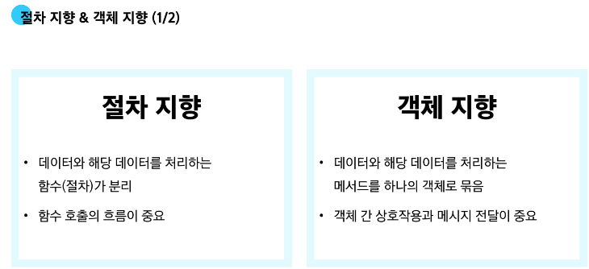
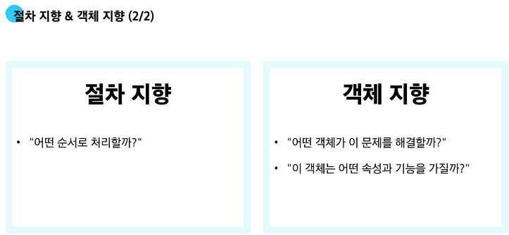

## 오늘 배운 내용
# 절차 지향 프로그래밍
- 절차 지향 프로그래밍 특징
  - 입력을 받고, 처리하고, 결과를 내는 과정이 위에서 아래로 순차적으로 흐르는 형태
  - 순차적인 명령어 실행
  - 데이터와 함수의 분리
  - 함수 호출의 흐름이 중요
- 절차 지향적 프로그래밍의 한계
  - 복잡성 증가
    - 프로그램 규모가 커질수록 데이터와 함수의 관리가 어려움
    - 전역 변수의 증가로 인한 관리의 어려움
  - 유지 보수 문제 
    - 코드 수정 시 영향 범위 파악이 어려움
# 객체 지향 프로그래밍
- 클래스는 설계도, 인스턴스는 실제 물건
- 객체 지향 프로그래밍 특징
  - 프로그램을 데이터(변수)와 그 데이터를 처리하는 함수(메서드)를 하나의 단위(객체)로 묶어서 조직적으로 관리
  - 데이터와 메서드의 결합
---
- 절차 지향과 객체 지향  
    
  
- 절차 지향과 객체 지향은 대조되는 개념이 아니다.
---
- 객체(object) : 실제 존재하는 사물을 추상화한 것 (속성과 동작을 가짐)
  - 예를 들어, '강아지'라는 객체는 이름, 종, 나이(특징)와 짖기, 뛰기(행동) 등으로 표현할 수 있다.
- 클래스(class) : 객체를 만들기 위한 설계도 (데이터와 기능을 함께 묶는 방법을 제공, 파이썬에서 타입을 표현하는 방법)
  - 클래스로부터 여러 개의 객체를 쉽게 만들어 낼 수 있습니다.
  - 클래스 비유 예시
    - 클래스 : 소나타 설계도
    - 인스턴스 : 소나타1, 소나타2, ...
    - 속성(변수) : 색깔, 가죽 종류, 지역, 차량 번호
    - 기능(메서드) : 직진하기, 후진하기, 우회전하기, 자율주행, ...
    
  - class의 이름은 파스칼 케이스(단어의 첫글자를 대문자로) 방식으로 작성 → 구분하기 위해
    ```py
    class Person:
    def __init__(self, name, age):
        # 인스턴스 속성
        self.name = name
        self.age = age

    def introduce(self):
        print(f"안녕하세요. 저는 {self.name}, 나이는 {self.age}살입니다.")

    p1 = Person("Alice", 25)
    p1.introduce() # 안녕하세요. 저는 Alice, 나이는 25살입니다.
    p2 = Person("Bella", 30)
    p2.introduce() # 안녕하세요. 저는 Bella, 나이는 30살입니다.
    ```
- 인스턴스 : 클래스를 통해 생성된 객체
  - 인스턴스는 클래스를 사용해 실제로 만들어진 객체
  - 같은 클래스로 여러 인스턴스를 만들 수 있으며, 각 인스턴스는 클래스 구조를 따라 동작하지만, 서로 독립된 데이터를 가질 수 있음

- 메서드 : 클래스 내부에 정의된 함수로, 해당 객체가 어떻게 동작할지를 정의
  - 인스턴스 메서드 : 인스턴스의 상태를 조작하거나 동작을 수행
    - **반드시 첫 번째 인자로 인스턴스 자신(self)을 받음** > 'hello'.upper()은 사실 str.upper('hello')이므로 self가 반드시 필요
    - self는 매개변수 이름일 뿐이며 다른 이름으로 설정 가능하지만 다른 이름을 사용하지 않을 것을 강력히 권장
    ```py
    class MyClass:
            def instance_method(self, arg1, ...):
                pass
    ```
  - 클래스 메서드 : 클래스 변수를 조작하거나 클래스 레벨의 동작을 수행합니다.
    ```py
    class MyClass:

        @classmethod
        def class_method(cls, arg1, ...):
            pass
    ```

    - cls는 매개변수 이름일 뿐이며 다른 이름으로 설정 가능하지만 다른 이름을 사용하지 않을 것을 강력히 권장

  - 스태틱 메서드 : 클래스, 인스턴스와 상관없이 독립적으로 동작하는 메서드
    ```py
    class MyClass:

        @staticmethod
        def static_method(arg1, ...):
            pass
    ```
---
# 매직 메서드
- __init__ 메서드는 '생성자 메서드'로 불리며, 새로운 객체를 만들 때 필요한 초기값을 설정 (표기 안해도 무방하지만 아래와 같이 생성하는 것을 권장)
```py
class Person:
    def __init__(self):
        pass
```
---
# 할 수 있다 != 써도 된다
- 클래스가 할 수 있는 것 : 클래스는 모든 메서드를 호출할 수 있지만 클래스는 클래스 메서드와 스태틱 메서드만 사용
- 인스턴스가 할 수 있는 것 : 인스턴스는 모든 메서드를 호출할 수 있지만 인스턴스 메서드만 사용
---
# 확인 문제
1 d
2 a
3 c
4 c
5 b
6 a
7 d
8 a
9 2
10 16