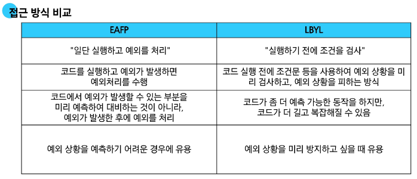

## 오늘 배운 내용
- 상속 : 한 클래스의 속성과 메서드를 다른 클래스가 물려받는 것
- 상속이 필요한 이유
  1. 코드 재사용
    - 상속을 통해 기존 클래스의 속성과 메서드를 재사용할 수 있음
    - 기존 클래스를 수정하지 않고도 기능을 확장할 수 있음
  2. 계층 구조
    - 상속을 통해 클래스들 간의 계층 구조를 형성할 수 있음
    - 부모 클래스와 자식 클래스 간의 관계를 표현하고, 더 구체적인 클래스를 만들 수 있음
  3. 유지 보수의 용이성
    - 상속을 통해 기존 클래스의 수정이 필요한 경우, 해당 클래스만 수정하면 되므로 유지 보수가 용이해짐
    - 코드의 일관성을 유지하고, 수정이 필요한 범위를 최소화할 수 있음

# 메서드 오버라이딩
- 부모 클래스의 메서드를 같은 이름, 같은 파라미터 구조로 재정의하는 것
- 메서드 오버라이딩 예
```py
class Animal:
    def eat(self):
        print('Animal이 먹는 중')


class Dog(Animal):
    # 오버라이딩 (부모 클래스 Animal의 eat 메서드를 재정의)
    def eat(delf):
        print('Dog가 먹는 중')

my_dog = Dog()
my_dog.eat() # Dog가 먹는 중
```
- [참고] 오버로딩 : 같은 이름, 다른 파라미터를 가진 여러 메서드를 정의하는 것(파이썬은 미지원)

# 다중 상속
- 둘 이상의 상우 ㅣ클래스로부터 여러 행동이나 특징을 상속받을 수 있음
- 상속받은 모든 클래스의 요소를 활용 가능
- 중복된 속성이나 메서드가 있는 경우 상속 순서에 의해 결정됨
```py
# 다중 상속 예시
class Person:
    def __init__(self, name):
        self.name = name

    def greeting(self):
        return f'안녕, {self.name}'


class Mom(Person):
    gene = 'XX'

    def swim(self):
        return '엄마가 수영'


class Dad(Person):
    gene = 'XY'

    def walk(self):
        return '아빠가 걷기'


class FirstChild(Dad, Mom): # 자신한테 없으면 Dad, Mom, Person 순으로 찾기
    def swim(self):
        return '첫째가 수영'

    def cry(self):
        return '첫째가 응애'


baby1 = FirstChild('아가')
print(baby1.cry())  # 첫째가 응애
print(baby1.swim())  # 첫째가 수영
print(baby1.walk())  # 아빠가 걷기
print(baby1.gene)  # XY
```
- MRO : 파이썬이 메서드를 찾는 순서에 대한 규칙 메서드 결정 순서
  - super() 메서드 : 메서드 해석 순서(MRO)에 따라, 현재 클래스의 부모 클래스의 메서드나 속성에 접근할 수 있게 해주는 내장 함수
  ```py
  # 단일 상속


  # super를 사용하지 않았을 때
  class Person:
      def __init__(self, name, age, number, email):
          self.name = name
          self.age = age
          self.number = number
          self.email = email


  class Student(Person):
      def __init__(self, name, age, number, email, student_id):
          self.name = name
          self.age = age
          self.number = number
          self.email = email
          self.student_id = student_id


  # super를 사용했을 때
  class Person:
      def __init__(self, name, age, number, email):
          self.name = name
          self.age = age
          self.number = number
          self.email = email


  class Student(Person):
      def __init__(self, name, age, number, email, student_id):
          # super()를 통해 Person의 __init__ 메서드 호출
          pass
          self.student_id = student_id
  ```
  ```py
  # 다중 상속
  class ParentA:
      def __init__(self):
          # super().__init__()
          self.value_a = 'ParentA'

      def show_value(self):
          print(f'Value from ParentA: {self.value_a}')


  class ParentB:
      def __init__(self):
          self.value_b = 'ParentB'

      def show_value(self):
          print(f'Value from ParentB: {self.value_b}')


  class Child(ParentA, ParentB):
      def __init__(self):
          super().__init__()  # ParentA 클래스의 __init__ 메서드 호출
          self.value_c = 'Child'

      def show_value(self):
          super().show_value()  # ParentA 클래스의 show_value 메서드 호출
          print(f'Value from Child: {self.value_c}')


  child = Child()
  child.show_value()
  """
  Value from ParentA: ParentA
  Value from Child: Child
  """

  print(child.value_c)  # Child
  print(child.value_a)  # ParentA
  print(
      child.value_b
  )  # AttributeError: 'Child' object has no attribute 'value_b'


  """
  <ParentA에 super().__init__()를 추가하면?>
  그 다음으로 ParentB의 __init__가 실행되어 value_b도 초기화할 수 있음
  그러면 print(child.value_b)는 ParentB를 출력하게 됨

  print(child.value_b)  # ParentB
  """

  """
  <Child 클래스의 MRO>
  Child -> ParentA -> ParentB

  super()는 단순히 “직계 부모 클래스를 가리킨다”가 아니라, 
  MRO 순서를 기반으로 “현재 클래스의 다음 순서” 클래스(또는 메서드)를 가리킴

  따라서 ParentA에서 super()를 부르면 MRO상 다음 클래스인 ParentB.__init__()가 호출됨
  """


  """
  1.1 Child 클래스의 인스턴스를 생성할 때 일어나는 일
      1.	child = Child() 호출 시, Child.__init__()가 실행
      2.	Child.__init__() 내부에서 super().__init__()를 호출
          - 여기서 Child의 super()는 MRO에 의해 ParentA의 __init__()를 가리킴
      3.	ParentA.__init__()로 진입

  1.2. ParentA.__init__() 내부
    1.	ParentA.__init__()에는 다시 super().__init__()가 있음
    2.	ParentA를 기준으로 MRO에서 “다음 클래스”는 ParentB, 따라서 ParentA의 super().__init__()는 ParentB.__init__() 호출
      3.	ParentB.__init__()가 실행되면서 self.value_b = 'ParentB'가 설정됨
    4.	ParentB.__init__()가 종료된 후, 다시 ParentA.__init__()로 돌아와 self.value_a = 'ParentA'가 설정됨
    5.	ParentA.__init__() 종료 후, 다시 Child.__init__()로 돌아감
    6.	마지막으로 Child.__init__() 내에서 self.value_c = 'Child'가 설정되고 종료

  1.3 결과적으로 child 인스턴스는 value_a, value_b, value_c 세 속성을 모두 갖게 됨
    - child.value_a → 'ParentA'
    - child.value_b → 'ParentB' 
    - child.value_c → 'Child'
  """
  ```
  - MRO가 필요한 이유
    - 부모 클래스들이 여러 번 엑세스 되지 않도록,
    - 왼쪽에서 오른쪽으로 가는 순서를 보존하고,
    - 각 부모를 오직 한 번만 호출하고,
    - 부모들의 우선순위에 영향을 주지 않으면서 서브 클래스를 만드는 단조적인 구조 형성
  
# 디버깅 방법
1. print 함수 활용
2. 개발 환경 등에서 제공하는 기능 활용
3. Python tutor 활용 (단순 파이썬 코드인 경우)
4. 뇌 컴파일, 눈 디버깅 등 
---
# 예외 처리
try, except 구문을 사용해 특정 예외를 잡아내고 원하는 동작을 수행
```py
# 예외를 한번에 묶기
try:
    x = int(input('숫자를 입력하세요: '))
    y = 10 / x
except (ZeroDivisionError, ValueError): # 예외가 발생했을 때 실행할 코드 작성
    print('제대로 입력하세요.')

# 예외를 나눌 수 있음
try:
    x = int(input('숫자를 입력하세요: '))
    y = 10 / x
except ZeroDivisionError: # 예외가 발생했을 때 실행할 코드 작성
    print('0으로 나눌 수 없습니다.')
except ValueError:
    print('유효한 숫자가 아닙니다.')
else: # 예외가 발생하지 않았을 때 실행할 코드 작성
    print(f'결과: {y}')
finally: # 무조건 실행됨
    print('프로그램이 종료되었습니다.')

my_list = []
try:
  number = my_list[1]
except IndexError as error:
  print(f'{error}가 발생했습니다.')
```
- if/else와 try/except의 차이


# 확인 문제
1 a  
2 a  
3 c  
4 b > 정답 d : SyntaxError는 런타임 예외가 아님  
5 새가 날아갑니다.  
6 c > 정답 d : 정적 메서드는 self나 cls가 없으므로 super()를 사용할 수 없다.  
7 b  
8 c  
9 b  
10 d  