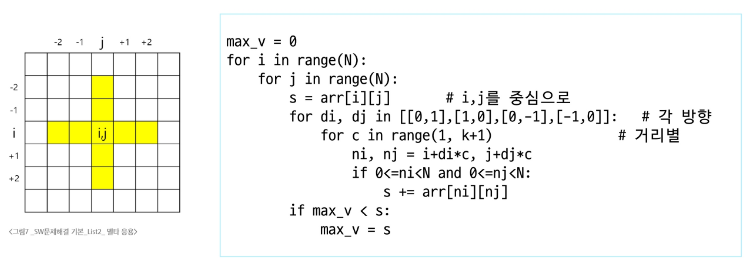

# 오늘 배운 내용
- 2차원 배열 리스트 컴프리헨션으로 입력하는 방법
  ```py
  N = int(input())
  arr1 = [list(map(int, input().split())) for _ in range(N)]
  """
  3
  1 2 3
  4 5 6
  7 8 9
  """
  print(arr1)

  N = int(input())
  arr2 = [list(map(int, input())) for _ in range(N)]
  print(arr2)
  """
  3
  123
  456
  789
  """
  ```
  - 지그재그 순회
  ```py
  for i in range(n):
    for j in range(m):
        print(array[i][j + (m-1-2*j) * (i%2)])

- 델타를 활용한 2차원 배열 탐색
   - 인덱스 (i, j)인 칸의 상하좌우 칸 (ni, nj)
     ```py
     di[] ← [0, 1, 0, -1]
     dj[] ← [1, 0, -1, 0]
     for k : 0 → 3
        ni ← i + di[k]
        nj ← j + di[k]
     ```  
    - N*N 배열에서 각 원소를 중심으로, 상하좌우 k칸의 합계 중 최댓값 (k=2)
    