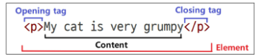
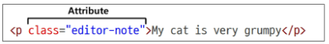
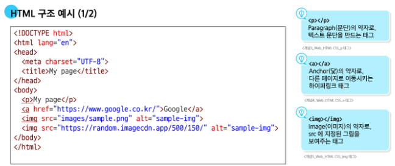

# 오늘 배운 내용
## Web page 구성 요소
HTML : structure
CSS : styling
JS : behavior

## HTML
- 웹 페이지의 의미와 구조를 정의하는 언어
- HyperText : 웹 페이지를 다른 페이지로 연결하는 링크
  - 참조를 통해 사용자가 한 문서에서 다른 문서로 접근할 수 있는 텍스트
  - 비선형성 / 상호연결성 / 사용자 주도적 탐색
- Markup Language : 태그 등을 이용하여 문서나 데이터의 구조를 명시하는 언어
  - 인간이 읽고 쓰기 쉬운 형태이며, 데이터의 구조와 의미를 정의하는 데 집중
  - 예시: HTML, Markdown
- 구조
  - <!DOCTYPE html>
    - 해당 문서가 html로 문서라는 것을 나타냄
  - <html></html>
    - 전체 페이지의 콘텐츠를 포함
  - <title></title>
    - 브라우저 탭 및 즐겨찾기 시 표시되는 제목으로 사용
  - <head></head> 
    - HTML 문서에 관련된 설명, 설정 등 컴퓨터가 식별하는 메타데이터를 작성
    - 사용자에게 보이지 않음
  - <body></body>
    - HTML 문서의 내용을 나타냄
    - 페이지에 표시되는 모든 콘텐츠를 작성
    - 한 문서에 하나의 body 요소만 존재
- 요소
  - 하나의 요소는 여는 태그와 닫는 태그 그리고 그 안의 내용으로 구성됨
  - 닫는 태그는 태그 이름 앞에 슬래시가 포함됨 (닫는 태그가 없는 태그도 존재)

- 속성
  - 사용자가 원하는 기준에 맞도록 요소를 설정하거나 다양한 방식으로 요소의 동작을 조절하기 위한 값
  - 목적
    - 나타내고 싶지 않지만 추가적인 기능, 내용을 담고 싶을 때 사용
    - CSS에서 스타일 적용을 위해 해당 요소를 선택하기 위한 값으로 활용됨  

  - 작성 규칙
    - 속성은 요소의 이름과 속성 사이에 공백이 있어야 함
    - 하나 이상의 속성들이 있는 경우엔 속성 사이에 공백으로 구분함
    - 속성 값은 열고 닫는 따옴표로 감싸야 함
